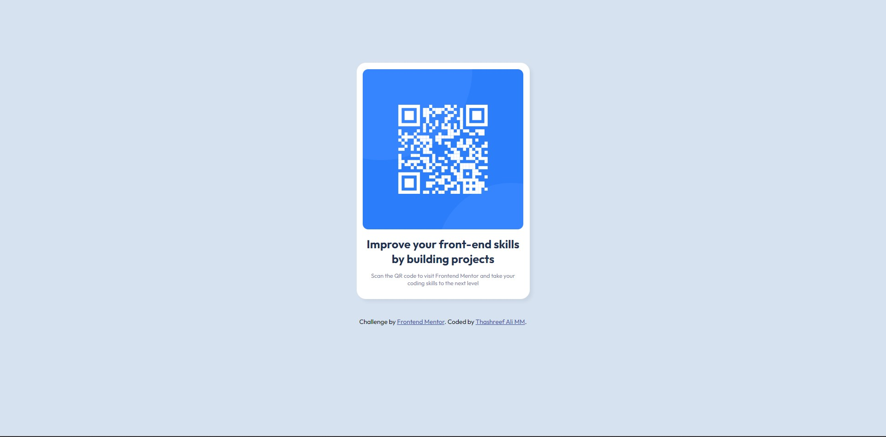

# Frontend Mentor - QR code component solution

This is a solution to the [QR code component challenge on Frontend Mentor](https://www.frontendmentor.io/challenges/qr-code-component-iux_sIO_H). Frontend Mentor challenges help you improve your coding skills by building realistic projects. 

## Table of contents

- [Overview](#overview)
  - [Screenshot](#screenshot)
  - [Links](#links)
- [My process](#my-process)
  - [Built with](#built-with)
  - [What I learned](#what-i-learned)
  - [Useful resources](#useful-resources)
- [Author](Thashreef Ali MM)
- [Acknowledgments](#acknowledgments)

**Note: Delete this note and update the table of contents based on what sections you keep.**

## Overview

### Screenshot

### Links

- Solution URL: (https://github.com/thasham/qr-code-component)

## My process

### Built with

- Semantic HTML5 markup
- CSS custom properties
- Flexbox
- CSS Grid
- Mobile-first workflow
- [Styled Components](https://styled-components.com/) - For styles

### What I learned

``css
:root{
    --White: hsl(0, 0%, 100%);
    --Light-gray: hsl(212, 45%, 89%);
    --Grayish-blue: hsl(220, 15%, 55%);
    --Dark-blue: hsl(218, 44%, 22%);
}
body{
 height: calc(100vh -1px);
 }
@media (min-width: 500px) {
    .container{
        width:300px;
    }
}``

If you want more help with writing markdown, we'd recommend checking out [The Markdown Guide](https://www.markdownguide.org/) to learn more.

### Useful resources
when I was stuck https://www.youtube.com/watch?v=JFyMWwOxHYM&t=865s&ab_channel=TsbSankara

###Author

- Website - Thashreef Ali MM(https://www.your-site.com)
- Frontend Mentor - thashreef (https://www.frontendmentor.io/profile/thasham)

## Acknowledgments

Good for reference tsbSankara(https://www.youtube.com/watch?v=JFyMWwOxHYM&t=865s&ab_channel=TsbSankara)

